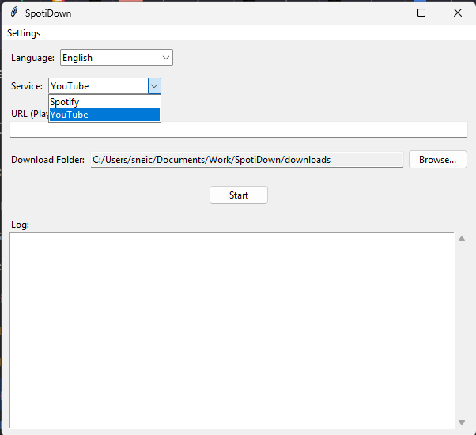

  

<h1 align="center">SpotiDown</h1>
<h3 align="center">Download Spotify & YouTube Music with Full Metadata</h3>

  <a href="#about-the-project">About</a> •
  <a href="#features">Features</a> •
  <a href="#requirements">Requirements</a> •
  <a href="#installation">Installation</a> •
  <a href="#how-to-use">How to Use</a> •
  <a href="#troubleshooting--faq">Troubleshooting & FAQ</a> •
  <a href="#disclaimer">Disclaimer</a>

---

<h2 id="about-the-project">About The Project</h2>

**SpotiDown** is a user-friendly desktop application for Windows that allows you to download any track or entire playlist from Spotify.

Unlike other downloaders, SpotiDown focuses on enriching your music library by fetching and embedding a rich set of metadata directly into your MP3 files. But it doesn't stop there - you can also paste a link from **YouTube**, and SpotiDown will intelligently identify the song, find its official data on Spotify, and download it with full album art, artist info, and even lyrics.

 

<h2 id="features">Features</h2>

- **Spotify Downloads:** Download single tracks or full playlists directly from Spotify URLs.
- **Smart YouTube Downloads:** Paste a YouTube link (single video or playlist), and the app will automatically identify the song, find its metadata on Spotify, and download it as a perfectly tagged MP3.
- **Rich Metadata:** Automatically embeds high-quality album art, artist, album, title, and lyrics from Spotify and Genius.com.
- **Fully Automated Setup:** A smart script handles all dependencies for you, including a local, portable version of FFmpeg. **No manual installation needed!**
- [cite_start]**User-Friendly Interface:** Clean UI with a simple dropdown to select your service, multi-language support, and a persistent settings menu. [cite: 12]

 

<h2 id="requirements">Requirements</h2>

There is only **one manual prerequisite** before you can run the application:

-   **Python:** You must have Python (version 3.8 or higher) installed.
    -   You can download it from [**python.org**](https://www.python.org/).
    -   **IMPORTANT:** During the Python installation, you **must** check the box that says **"Add Python to PATH"**. The setup script relies on this.

  

### What is handled automatically?

You **do not** need to install any of the following yourself. The `start.bat` script will handle them for you:
-   All required Python libraries (`spotipy`, `yt-dlp`, `thefuzz`, etc.).
-   **FFmpeg:** The script automatically downloads a pre-compiled, portable version. **You do not need Git.**

 

<h2 id="installation">Installation</h2>

The installation is designed to be as simple as possible.

### Step 1: Download the Project

1.  Go to the **[Releases Page](https://github.com/K1ta3ca/SpotiDown/releases)** of this repository.
2.  Download the latest `SpotiDown_vX.X.zip` file.
3.  Extract the ZIP file to a permanent folder on your computer (e.g., `C:\Tools\SpotiDown`).

### Step 2: Run the Setup & Launch Script

Inside the extracted folder, simply double-click the **`start.bat`** file. The script will automatically install all dependencies and then launch the application.

  

This initial setup might take a few minutes. All subsequent launches will be instant.

### Step 3: Enter Your API Keys

The first time the app launches, it will prompt you to enter your API keys from Spotify and Genius.com. These are required for all features, including the smart YouTube song recognition. Once saved, you won't be asked for them again unless you want to change them from the "Settings" menu.

 

<h2 id="how-to-use">How to Use</h2>

  

1.  **Launch:** Double-click `start.bat`.
2.  **Choose Service:** Select "Spotify" or "YouTube" from the dropdown menu.
3.  **Set Download Folder:** Click **"Browse..."** to choose where your music will be saved.
4.  **Paste URL:** Copy a link (track, playlist, or video) and paste it into the URL field. The app will automatically clean up the link for you.
5.  **Download:** Click the **"Start"** button.

 

<h2 id="troubleshooting--faq">Troubleshooting & FAQ</h2>

**Q: The setup script (black window) shows an error and closes.**
**A:** This is usually due to a network issue or a firewall/antivirus blocking the script.
-   Make sure you have a stable internet connection.
-   Try running `start.bat` as an Administrator (right-click -> "Run as administrator").
-   Check if your antivirus software is blocking PowerShell or the download of FFmpeg.

**Q: I downloaded a song, but the lyrics don't show up in my phone's music app.**
**A:** **This is expected behavior for many default phone music players.** Modern streaming apps are designed to **ignore local metadata** and fetch lyrics from their own online servers. To see the embedded lyrics, use a player that prioritizes local files, such as **AIMP** or **Musicolet** (free on Google Play Store).

 

<h2 id="disclaimer">Disclaimer</h2>

This software is provided for educational purposes only. Downloading copyrighted material may be illegal in your country. The developer assumes no responsibility for your actions. Please support the artists by buying their music and streaming on official platforms.
